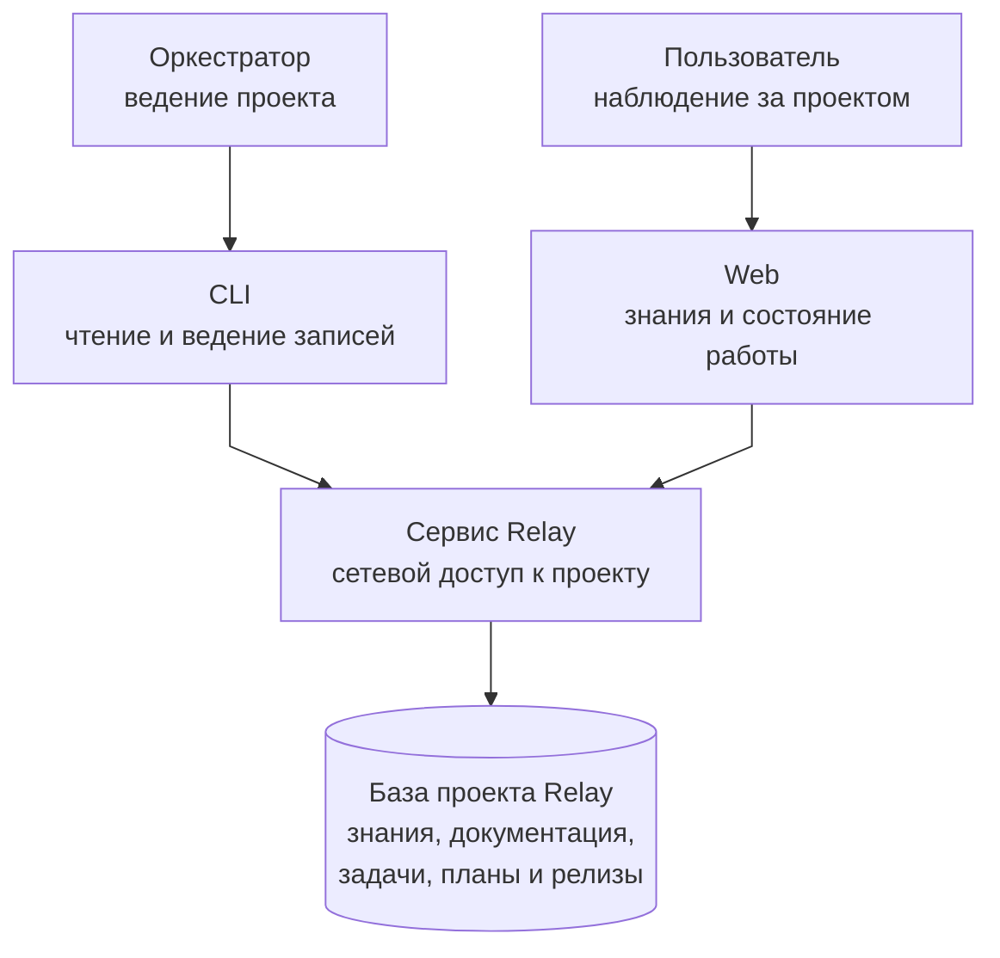
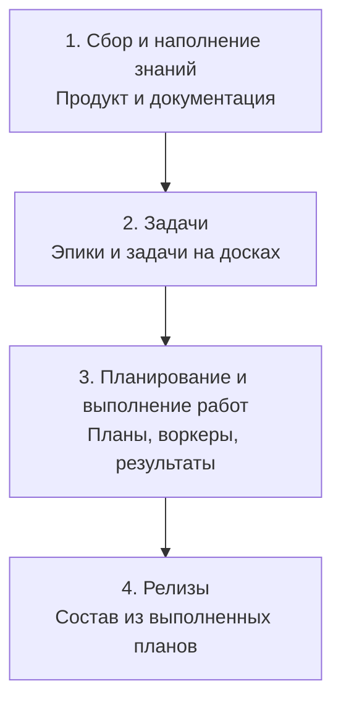
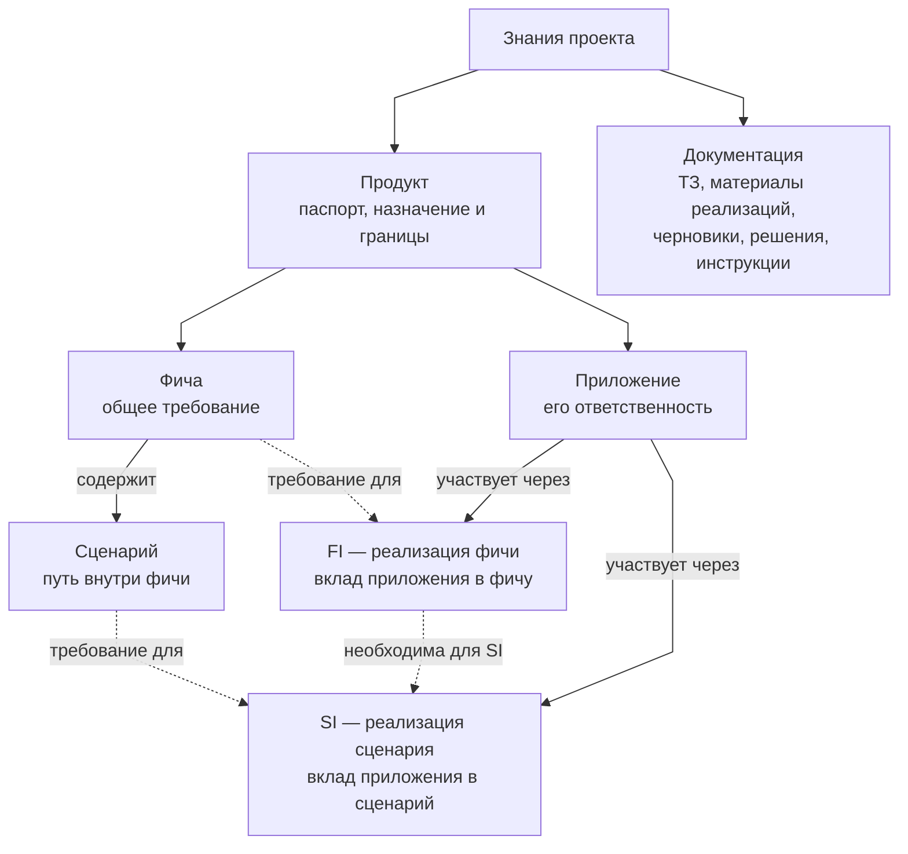
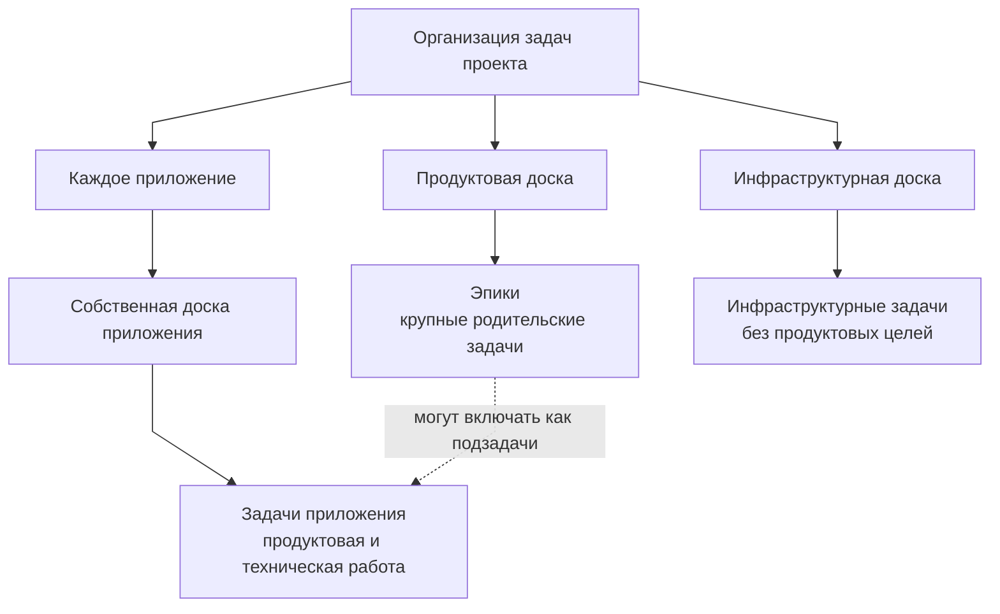
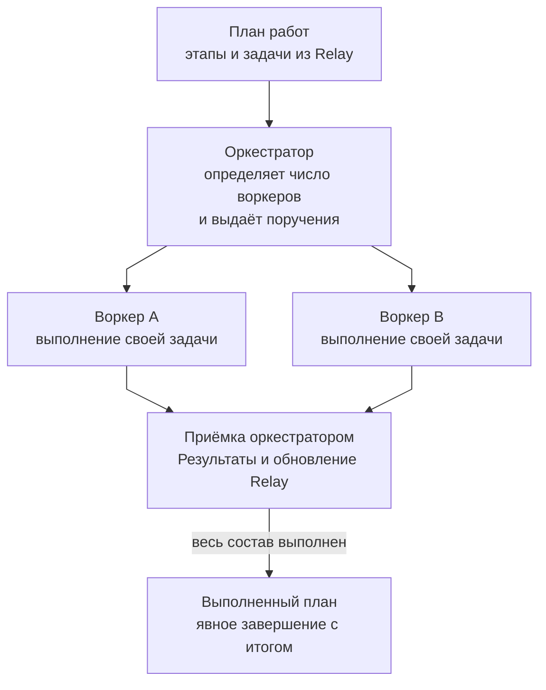
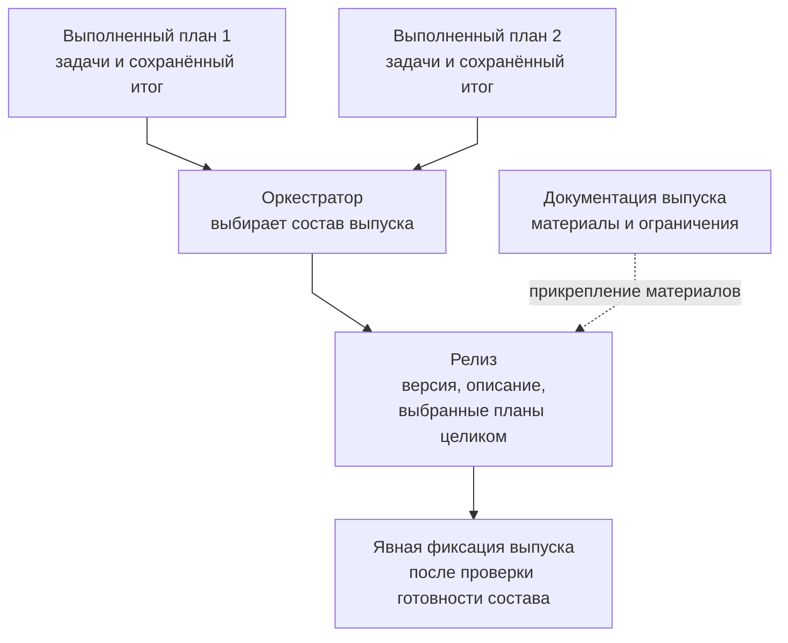

# Relay: модель проекта и жизненный цикл

Материал для знакомства команды с Relay: что хранится в базе проекта, как связаны
продукт и работа, какую роль выполняет оркестратор и как формируется релиз.

## Что такое Relay

**Relay — общая память проекта для человека и AI-агентов.** В базе сохраняются
описание продукта, требования, документация, задачи, планы, результаты работы
и сведения о выпусках. Это позволяет продолжать проект между сессиями, опираясь
на сохранённые знания и актуальное состояние работы.

**Оркестратор ведёт весь жизненный цикл проекта через Relay.** Он работает
с пользователем, наполняет базу, декомпозирует работу, ставит задачи, вызывает
воркеров, принимает результаты и обновляет записи. Его основной инструмент — CLI Relay.

Пользователь передаёт исходный запрос и материалы, отвечает на уточнения и наблюдает
за ходом работы. Ведение базы и управление исполнителями выполняет оркестратор.

## Архитектура взаимодействия

Две ветки показывают доступ к общему проекту: оркестратор читает и изменяет записи
через CLI, пользователь наблюдает через Web. Сервис Relay предоставляет обоим
интерфейсам доступ к одной базе выбранного проекта.

**На схеме показано подключение CLI через сервер.** В локальном режиме CLI обращается
к той же базе напрямую через штатные операции Relay. Сервис при этом продолжает
обеспечивать наблюдение пользователя в Web.

Пользователь передаёт запрос и уточнения оркестратору. Оркестратор ставит задачи
воркерам, принимает их результаты и сохраняет их через CLI. Распределение поручений
и возврат результатов показаны отдельно на схеме планирования и выполнения работ.

- **База проекта** — общее место для знаний и состояния работы. Данные сохраняются
  в JSON-файлах, по умолчанию в `.relay`.
- **CLI** позволяет оркестратору работать локально или через сервис Relay.
  Оба пути используют одни предметные правила и данные выбранного проекта.
- **Web** даёт пользователю возможность наблюдать за проектом. Редактирование
  через Web тоже доступно, но основной процесс ведения данных поручен оркестратору.
- **Сервис Relay** обеспечивает работу Web и сетевое подключение. Для наблюдения
  пользователя он нужен и при локальной работе оркестратора через CLI.
- **MCP** — дополнительный интерфейс агента, используемый по явному выбору пользователя;
  ему также нужен работающий сервис Relay.

Оркестратор и воркеры работают во внешней агентской среде. Там же выполняются
изменения кода, тестирование и поставка. Relay сохраняет знания и результаты
этих действий, применяет правила работы с записями и рассчитывает прогресс.

Профили агентов, используемые для разработки самого Relay, относятся к инструментам
его разработки. Они не задают состав воркеров пользовательского проекта.

## Жизненный цикл: четыре этапа

**Сбор и наполнение знаний → Задачи → Планирование и выполнение работ → Релизы.**

Это основной порядок ведения проекта. Каждый блок — отдельный этап;
его состав и результат раскрыты ниже.

> **Документация сопровождает все четыре этапа.** Библиотека появляется при сборе
> знаний и пополняется при постановке задач, выполнении работ и подготовке выпусков.
> Это общие материалы проекта, доступные на протяжении всего жизненного цикла.

### 1. Сбор и наполнение знаний

На этом этапе формируются **продуктовая модель и библиотека документации**.
Схема раскрывает состав знаний и связи требований с приложениями:

Продукт описывается в порядке **паспорт → фичи и сценарии → приложения
и имплементации**. На схеме имплементация получает два основания: общее требование
и ответственность конкретного приложения. FI относится к фиче, SI — к сценарию.
Документация формируется параллельно и прикрепляется к нужным записям на всех этапах.

Оркестратор вместе с пользователем разбирает исходный запрос и сохраняет знания:

1. **Паспорт продукта:** назначение, пользователи, ожидаемая ценность, границы
   и ограничения. В проекте один продукт.
2. **Фичи:** возможности продукта и общие требования к их поведению.
3. **Сценарии внутри фич:** конкретные пути, предусловия, действия, ошибки
   и ожидаемые результаты.
4. **Приложения:** программные части продукта и их ответственность.
5. **Имплементации приложений:** какой вклад каждое приложение вносит в выбранные
   фичи и сценарии.

У имплементаций есть два варианта:

- **FI** — реализация фичи определённым приложением.
- **SI** — реализация сценария определённым приложением.

SI требует FI той же фичи в том же приложении. Нужные сценарии выбираются явно:
включение фичи не означает автоматического включения всех её сценариев.

Например, общая фича описывает приём заявки, сценарий — её отправку пользователем.
Имплементация Web описывает работу формы, имплементация Backend — приём и сохранение
данных. Конкретные изменения для этого поведения позже оформляются задачами.

#### Документация — часть наполнения знаний

Одновременно оркестратор формирует библиотеку материалов. В неё входят:

- исходное ТЗ и дополнительные требования;
- пояснения пользователя и продуктовые описания;
- материалы и описания продуктовых реализаций;
- черновики, предложения, исследования и открытые вопросы;
- принятые решения, правила и инструкции;
- другие документы, необходимые на протяжении жизненного цикла проекта.

Библиотека пополняется по мере появления знаний. Документы прикрепляются
к соответствующим записям: продукту, фичам, сценариям, приложениям и имплементациям,
а затем — к задачам, планам и релизам. Один материал может использоваться
в нескольких местах без копирования его содержания.

Фичи, сценарии и имплементации сохраняют собственные требования и обязательства.
Документация даёт их основания, подробные материалы и пояснения. Черновики и предложения
отличаются от принятых решений; неизвестные требования оркестратор уточняет у пользователя.

**Результат этапа:** в базе достаточно знаний, чтобы понять ближайший объём работы,
сформулировать задачи и определить способы проверки результата.

### 2. Задачи: определяем, что нужно сделать

- **Продуктовая доска содержит эпики:** крупные родительские задачи, которые
  организуют общую работу по продукту. В данных Relay эпик представлен обычной
  задачей с подзадачами.
- **У каждого приложения своя доска:** на ней находятся задачи этого приложения.
- **Инфраструктурная доска содержит инфраструктурную работу:** у таких задач
  нет продуктовых целей. При необходимости инфраструктурная задача может быть
  обязательной зависимостью другой работы.

Оркестратор сам декомпозирует работу, создаёт задачи в Relay, задаёт критерии,
родительство и зависимости, прикрепляет документы-основания.

У задач продуктовой доски целями могут быть фичи и сценарии. У задач приложения —
его FI/SI. Задача может обходиться без продуктовой цели, например при работе
над каркасом приложения. Назначенная цель включает задачу в расчёт её готовности.

**Результат этапа:** задачи уже находятся в Relay, имеют понятные основания,
границы и ожидаемые результаты и могут быть переданы исполнителям.

### 3. Планирование и выполнение работ

Оркестратор составляет планы работ из существующих задач, распределяет их
по этапам и определяет, сколько воркеров запустить для ближайшего объёма.
Число воркеров и параллельность выбираются по независимости задач, зависимостям
и пересечению областей работы.

Воркеры получают самостоятельные поручения по задачам, уже поставленным в Relay.
Они выполняют работу и проверки во внешней среде, возвращают результат,
подтверждения, ограничения и блокеры. Независимая работа выполняется параллельно;
конкретный способ изоляции обеспечивает внешняя среда.

Оркестратор принимает результаты, при необходимости организует проверку или доработку,
заносит итог в Relay, актуализирует документацию, отмечает выполненные критерии
и обновляет состояния задач. Пользователь наблюдает за ходом работы в Web.

План может содержать одну задачу или объединять задачи разных приложений и досок.
Его этапы включают задачи явно: подзадачи и зависимости не добавляются в состав
автоматически. Порядок этапов организует план; обязательную последовательность
работ задают зависимости задач.

**Результат этапа:** выполненные задачи, сохранённые результаты и ограничения,
актуализированные знания и явно завершённые планы с содержательными итогами.

### 4. Релизы

Оркестратор определяет состав нужного выпуска и выбирает, какие выполненные планы
в него входят. Планы включаются целиком.

Перед фиксацией выпуска оркестратор проверяет, что выбранные планы завершены,
а их задачи и обязательства фактически выполнены. В релизе сохраняются состав,
обозначение версии, описание и сведения о выпуске; нужные материалы прикрепляются
из библиотеки документов.

Сборка, публикация и развёртывание выполняются во внешней среде и при необходимости
оформляются отдельными задачами. Запись о релизе сохраняет сведения о результате,
но сама поставку не выполняет.

**Целевая модель — релиз приложения.** Сейчас релиз хранится на уровне проекта
и содержит выбранные планы; структурированной привязки к приложению ещё нет.

Основной процесс предполагает сбор релиза из выполненных планов. При этом Relay
позволяет заранее сохранить плановый релиз с незавершёнными планами; зафиксировать
выпуск можно только при выполнении условий готовности.

**Результат этапа:** понятный состав выпуска и сохранённые сведения о его результате.

## Как читать состояние проекта

У готовности две ветки, связанные с задачами:

- **Продуктовая:** задачи и обязательства имплементаций, сценариев и фич определяют
  готовность продукта и приложений.
- **Плановая:** выполнение выбранных задач определяет текущую готовность плана;
  завершённые и фактически готовые планы определяют готовность релиза.

Готовность продукта не является источником готовности плана: у них разный состав.
Выполнение задачи требует `done`, выполненных критериев, подзадач и обязательных
зависимостей. Отмена не считается успешным выполнением.

Оркестратор завершает план отдельным действием с итогом. Фиксация выпуска тоже
выполняется явно. Статусы не заменяют проверки реального результата: их основания
сохраняются в комментариях задач, итогах планов и документах.

При изменении обязательств текущая готовность может измениться, даже если статус
завершённого плана или выпущенного релиза сохранился. Исторического снимка состава
выпуска сейчас нет; читается текущее состояние связанных записей.

## Продолжение проекта и границы текущих возможностей

В новой сессии оркестратор читает уже сохранённые знания, документацию, задачи
и планы. Новый запрос дополняет эту базу и запускает следующий объём работы
по тому же циклу. Существенные знания и результаты должны оставаться в Relay,
чтобы продолжение не зависело от прежнего диалога с агентом.

При использовании важно учитывать:

- Web, CLI и MCP предоставляют неодинаковый набор действий. Основной инструмент
  оркестратора — CLI; покрытие каждого интерфейса описано в матрице возможностей.
- Закрытые планы и выпущенные релизы неизменяемы.
- База хранит текущее состояние. Автоматическая история изменений и автоматическое
  сохранение в Git не являются её свойствами.
- Инфраструктурная доска уже существует. Полноценный раздел инфраструктуры
  со сведениями о приложениях, стендах и CI/CD остаётся направлением развития.
- Описанная роль оркестратора задаёт способ работы с Relay. Готовность конкретной
  реализации оркестратора, собственного чата и интеграций определяется отдельно;
  сроки и номера будущих версий требуют согласованных планов.

## Подробные правила

- [Назначение Relay](docs/PRODUCT.md).
- [Предметная модель](docs/domain/README.md).
- [Возможности интерфейсов](docs/CAPABILITIES.md).
- [Рабочий процесс](docs/guides/WORKFLOW.md).
- [Полезное содержание записей](docs/guides/CONTENT.md).
- [Документы и библиотека знаний](docs/domain/DOCUMENTS.md).

**Итоговая модель:** оркестратор наполняет базу знаниями и документацией,
декомпозирует работу на досках, организует выполнение планов воркерами,
принимает и сохраняет результаты, затем собирает выполненные планы в релиз.
Пользователь наблюдает за этим процессом и отвечает на необходимые уточнения.
